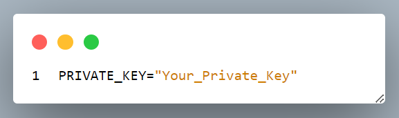

# Dojima Hackathon

- The first things you need to do is cloning this repository and installing its
dependencies:

```bash
$ git clone https://github.com/dojimanetwork/dojima-hackathon-template.git

$ cd hardhat

$ npm install
```
- Ensure your Node.js version is greater than 18.0.0.

### Setup genesis

Setup genesis whenever contracts get changed
### 1. Install dependencies and submodules
```bash
$ npm install

```

### 2. Compile contracts
```bash
#installation of npm v18.0.0 is required
$ npx hardhat compile
```
Should get the output similar to
```bash
Compiled 1 Solidity file successfully (evm target: paris).
```

### 3. Testing Contracts
```bash
$ npx hardhat test
```
Should get the output similar to
```bash
TestToken
    ✔ Should have correct name, symbol, and initial supply (101ms)
    ✔ Should mint tokens to specified address
    ✔ Should allow owner to pause and unpause the contract
    ✔ Should transfer tokens between accounts when not paused
    ✔ Should not transfer tokens when paused (75ms)


  5 passing (13s)
```

### 4. Deploy Contracts to Dojima Chain
- Rename `.env.example` file to `.env`
- Paste your wallet address `Private Key` in the `.env` file


- To deploy the smart contract run the script
```bash
$ npx hardhat run scripts/deploy.js --network dojima_chain_devnet
```
Should get the output similar to
```bash
Wallet Address:  0x4ba5B96dBee62274B4F72817e76C7bb9fAaD3126
Deploying TestToken...
Test Token deployed to: 0xA8548F964cBBfD495a966bB79e9f13493f301aB4
```


### PR Submission Guidelines

1. Fork `dojima-hackathon-template` repository
2. Create a new folder with `project-name` inside ``hackathon/<hackathon-name>`` folder in main branch
3. Copy your entire project repository and add a `README` file.
4. `README` file should contain the following:
```markdown
1. Project name and its members
2. Description
3. Tag-line (if-any)
4. Logo (optional)
5. Steps to follow for testing the project
6. Deployed contract address on top of DOJIMA blockchain
```
5. Submit a `Pull Request` to this repository with your changes.

#### Happy _building_! 😀